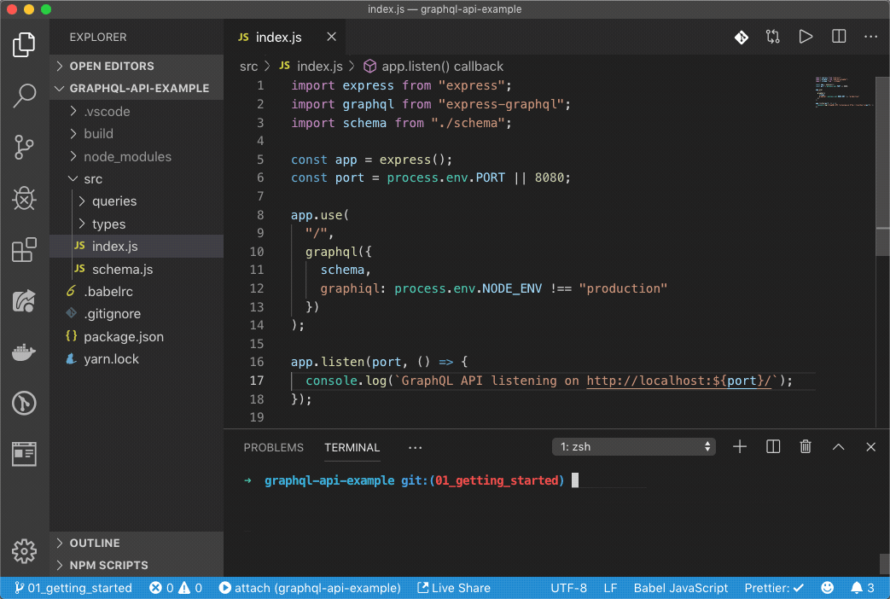
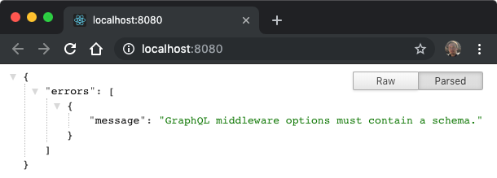

# Getting Started

## Step 1: Create Node.js project

During this step, you want to ensure that at least the following things are taken care of:

* You can use the latest \(modern\) JavaScript syntax \(most likely using [Babel](https://babeljs.io/) \)
* You can launch the app by running `yarn start`  which is a commonly used convention.
* When you make changes to the source code, the app \(API\) automatically restarts \(see [Nodemon](https://github.com/remy/nodemon)\).
* You can debug you Node.js code using VS Code debugger or similar tool.



Assuming that you already have [**Node.js**](https://nodejs.org) and [**Yarn**](https://yarnpkg.com) \(or, NPM\) installed,  bootstrap a new Node.js project by running:

```bash
# Creates package.json file in the root of the project's folder
$ yarn init

# Installs Express.js and GraphQL.js NPM modules (runtime dependencies)
$ yarn add graphql express express-graphql

# Installs Nodemon and Babel (dev dependencies)
$ yarn add nodemon @babel/core @babel/cli @babel/preset-env --dev
```

Create `.babelrc` file containing Babel configuration. Add `"start"` script to the `package.json` file:



```yaml
{
  "name": "api",
  "version": "1.0.0",
  "private": true,
  "dependencies": {
    "express": "^4.17.1",
    "express-graphql": "^0.9.0",
    "graphql": "^14.5.4"
  },
  "devDependencies": {
    "@babel/cli": "^7.6.0",
    "@babel/core": "^7.6.0",
    "@babel/node": "^7.6.1",
    "nodemon": "^1.19.2"
  },
  "scripts": {
    "build": "babel src --out-dir build --source-maps=inline --delete-dir-on-start --copy-files --verbose",
    "start": "yarn build --watch & sleep 1 && nodemon --watch build build/index.js"
  }
}
```



```yaml
{
  "presets": [
    ["@babel/preset-env", { "targets": { "node": "10.15.3" } }]
  ]
}
```




Note that the actual versions of all the listed dependencies above may differ from what you would end up having in your `package.json` file, but it shouldn't  be a problem.


Finally, create `src/index.js` file that will serve as an entry point to the \([Express.js](http://expressjs.com/)\) app:

```javascript
import express from 'express';
import graphql from 'express-graphql';

const app = express();
const port = process.env.PORT || 8080;

app.use('/', graphql({
  schema: null, // TODO: Implement GraphQL API schema
  graphiql: process.env.NODE_ENV !== 'production',
}));

app.listen(port, () => {
  console.log(`GraphQL API listening on http://localhost:${port}/`);
});
```

At this point, when you launch the app by running `yarn start` and navigate to `http://localhost:8080/` in the browser's window, you must be able to see the following: 




**Congratulations!** This means that the step \#1 is complete and we can move on to the next one — creating our first GraphQL schema required by the **`express-graphql`** middleware.


## Step 2: Create GraphQL schema

Basically, you create an GraphQL API by describing the hierarchy \(schema\) of all the \(query\) fields and mutations that the API must support.

Imagine that we need to fetch some OS-related info from the server using this query:



```graphql
query {
  environment {
    arch
    platform
    uptime
  }
}
```



```javascript
{
  data: {
    environment: {
      arch: 'x64',
      platform: 'linux',
      uptime: 11.256
    }
  }
}
```



It's asking for `arch`, `platform`, and `uptime` values grouped under the top-level `envrionment` field.

For this particular API we would need to implement just one GraphQL type \("Environment"\), and one top-level query field "environment". But since, we're planning to add more types and query fields later on, it would be good idea to group them under `src/types` and `src/queires`  folders, plus you would add `src/schema.js` file with the "schema" GraphQL object type.


...

